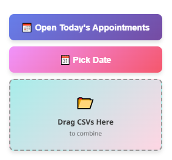

# About
This is a very simple totally ***not*** vibe-coded appointment grabber for use with TamperMonkey on zcal.co,
created by me, Bro Sir Edward. Best coder this side of the chatacchoochie or whatever its called.

# Installation
1. Download the [Tampermonkey](https://www.tampermonkey.net/) extension for the browser you use. (note: This was only tested on Edge because I am lazy)
2. On the dashboard, drag the downloaded .js file and click install. Alternatively you can create a new userscript and copy the contents manually if you prefer.
3. Save the file, then close the browser.

## Initial setup

If installed correctly, when looking at the zcal page, you should see this in the bottom left corner.
If not, then you done goofed. Seek out a trusted adult.

When running it the first time, you'll have to allow pop-ups from zcal due to how it opens the tabs. Ill maybe look into fixing this one day but probably not.

## Usage
To start, Click the **Open Today's Appointments Button** and let it do its thing.

*Note: this is when it will prompt you to enable pop-ups if they are not enabled, click allow.*

After it downloads all the files for the day, go to your downloads folder and select all the files it downloaded, and drag them into the **Drag CSVs here** area to combine them all into one file, and remove the unnecessary information.
Open the new file and copy it to Word, format it how you want and print.

### Notes
hello hi
